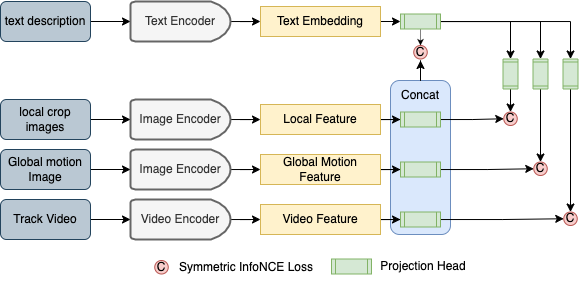

# **Vehicle Retrieval using Natural Language Queries**
Aishwarya Jadhav
anjadhav@cs.cmu.edu  
Benny Jiang
xinhaoji@cs.cmu.edu  
Vivek Sourabh vsourabh@cs.cmu.edu  
Eric Huang jiahuihu@andrew.cmu.edu  
Xiyang Hu xiyanghu@cmu.edu  
# **1.Catalogue**
* **Instruction**  
* **Video Feature Extraction**  
* **POC(Feasibility Test)**
    * Baseline result
* **ALG(Algorithm Test)**
    * 
* **EXP(Other Experimence)**

        

# **2. Instruction**
Vehicle Retrieval is crucial task for important aspects of a smart city such as efficient traffic man-
agement, etc. With time as the number of vehicles on the road increases, the amount of data
collected/stored increases. This calls for an efficient way to fuse different modalities of data, to create
a system that is able to efficiently retrieve useful information as per the users request.
  
In our project, we are using the winner system from AI City Natural Language Vehicle Retrieval last
year as our baseline model. This model calculates the relevance between text description and
vehicle tracks with the following features.

# **3.Prepare:**
To install all the requirements:  
*conda create --name <env_name> --file requirements.txt*  

The directory structures in `data` and `checkpoints` are as follows：
```
.
├── baseline
├── data
├── checkpoints
├── IG65_extraction
└── data
```
**3.1.Dataset:**  
Our dataset is from the 2022 AI City Challenge Track 2: Tracked-Vehicle Retrieval by Natural
Language Descriptions. Specifically, the training dataset contains 2,155 vehicle tracks. Every vehicle
track has been annotated with 3 natural language descriptions of the target. For the test dataset, there
are 184 tracks of candidate target vehicles, and 184 queries with each of them containing three natural
language descriptions of the vehicle target.  
[Dataset Address](https://www.aicitychallenge.org/)

**3.2.Video Feature Extraction:**
1. In the folder ./IG65_extraction, we are trying to merge images into videos.
2. By using the ./image_to_vid.py to generate the video
3. By using the ./extract_ig65m.py to extract the video feature.
