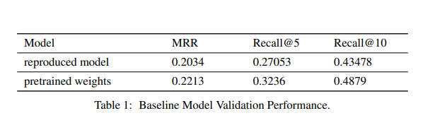

In our project, we are using the winner system from AI City Natural Language Vehicle Retrieval last year [1] as our baseline model. This model calculates the relevance between text description and vehicle tracks with the following features.
1. For text description, the system generates sentence embeddings from BERT[ 9 ] or
RoBERTa[10].
2. For vehicle image crops from the video tracks, the model applies pretrained visual encoding
models such as EfficientNet[21] to generate crop image embeddings.
3. The system also combine vehicle crops in different frames into a same background image to
generate a motion image, and then use the same pretrained visual model to generate motion
image embeddings.

